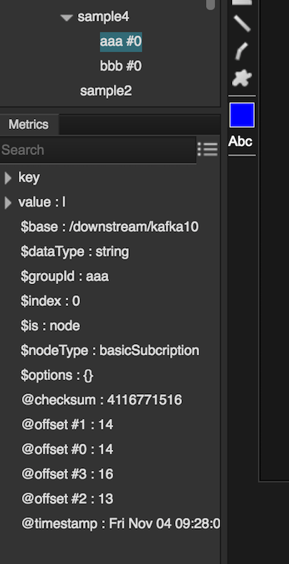

# dslink-scala-kafka10
A Scala-based DSLink implementation for Apache Kafka 0.10.x

Scala-based DSLink for integration with [Apache Kafka](https://kafka.apache.org) version 0.10.x. 

## Highlights
 - Compatible with Kafka 0.9.1 and 0.10.x brokers.
 - Supports data publishing in String, Integer and Binary (byte array) formats.
 - Provides automatic topic and partition discovery.
 - Supports Basic and Advanced modes for consuming data from Kafka:
   - In Basic mode, users can subscribe to a particular topic; Kafka provides automatic offset 
     commits and dynamic partition distribution.
   - In Advanced mode, users can subscribe to any combination of topics and partitions; 
     offsets and partitions can be managed manually.
 - Supports data streaming in String, Integer and Binary (byte array) formats.
     
## Essential Information

### License

The license is Apache 2.0, see [LICENSE](LICENSE).

### Installation in DGLux

1. Connect to DGLux platform by navigating to <http://localhost:8080> in your browser.
2. Switch to **Data** panel on the left, expand **sys** node and right click on **links**. 
4. Select *Install Link* command in the context menu and choose **kafka10**.
5. Choose any name you want and click *Invoke*. The Kafka10 DSLink will be installed 
   to your platform and you should see **kafka10** node in the */downstream/* tree.
 
## Using Kafka10 DSLink

### Connecting to the Kafka broker

1. Once you successfully installed Kafka10 DSLink in DGLux, right click on **kafka10** node
under */downstream/* and choose *Add Connection* action. Specify a name and broker list for the
new connection and click *Invoke*. The **brokers** field should contain a comma separated list
of Kafka brokers with an optional port. You should see a new connection node under 
*/downstream/kafka10/* now.
2. Right click on the new connection node and choose *List Topics* action. Check **createNodes** box
and click *Invoke*. The program will retrieve the list of topics from the broker and display them 
along with their partitions in a table. Since you checked *createNodes* parameter, it will also
create child nodes, one per topic, under the current connection node.
3.You can also manually add a single topic node if you do not want to retrieve and populate them all. 
For that, right click on the connection node and choose *Add Topic* action.

### Publishing messages

1. Right click on a connection node under */downstream/kafka10/* and choose *Publish as Text*,
*Publish as Int* or *Publish as Binary*. Internally, Kafka stores all messages as raw byte arrays, 
but the dslink allows you to enter the data in readably format before converting it to bytes.
2. Invoking any of the three actions above brings an action window with the following fields:
   - **key** - an optional message key. Each Kafka topic constists of one or more partitions, and each
     arriving message is placed into one partition. Messages with the same key will be placed into the
     same partition. If the key is not specified, Kafka will pick a partition randomly.
   - **value** - the message itself.
   - **topicName** the name of the topic where the message is to be posted.
   - **partition** - optionally, you can explicitly specify the partition where to post the message;
     this will override the automatic partition allocation.
   - **timestamp** - an optional timestamp to associate with the message. By default, the current time
     will be used by the broker.
   - **options** - additional options to pass to the Kafka producer client before publishing the message. 
     This field can contain multiple options in the format: *name1=value1, name2=value2, ...*.
     Refer to [Kafka Manual](https://kafka.apache.org/documentation#producerconfigs) for the list
     of available producer options.
   - **flush** - this flag indicates whether the client should flush the producer's buffer to ensure
     the message has been sent to Kafka.
3. You can also invoke publishing actions from the topic nodes under connection. In this case, the
   action dialog will be missing **topicName** entry, but all other options stay the same.
   
### Receiving messages

1. Right click on a topic node under your Kafka connection and choose *Subscribe as Text*,
*Subscribe as Int* or *Subscribe as Binary*.
2. Specify the subscriber's groupId and additional options in the action dialog. Options should be
in the format: *name1=value1, name2=value2, ...*. Refer to 
[Kafka Manual](https://kafka.apache.org/documentation#newconsumerconfigs) for the list of available 
consumer options.
3. You should now see a new subscription child node under your topic node. Right click on it and
choose *Start* to start streaming data from Kafka. Each incoming message will be reflected in its
children *key* and *value* nodes; additionally, this node will contain the checksum and timestamp
of the last downloaded message, as well as consumer's offsets of all topic partitions.

